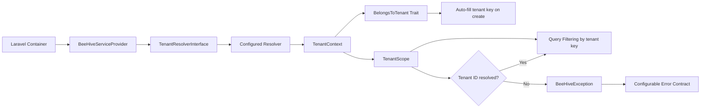

# equidna/bee-hive

Reusable multi-tenant foundation package for Laravel projects.

## What It Includes

- Tenant resolver contract
- Tenant context container
- Eloquent global scope for tenant filtering
- BelongsToTenant trait with automatic tenant key fill
- Service provider with publishable config

## Architecture

Flow summary:

1. The service provider binds the configured tenant resolver and initializes `TenantContext`.
2. `TenantScope` reads the tenant from context to enforce query-level isolation.
3. `BelongsToTenant` uses the same context to auto-assign tenant key values on model creation.
4. Missing tenant resolution always throws `BeeHiveException` with configurable response contract.

## Error Contract Options

BeeHive exceptions support configurable JSON contracts to keep API error formats consistent across services.

Config keys (in `config/bee-hive.php`):

- `errors.status`: HTTP status code for tenant resolution errors (default: `422`)
- `errors.contract`: `enterprise` (default), `flat`, or `problem_details`
- `errors.code`: machine-readable error code (default: `tenant_not_resolved`)
- `errors.include_decorative_payload`: include ASCII bee payload when `true` (default: `false`)
- `logging.enabled`: enable package log emission (default: `true`)
- `logging.level`: package log level (`warning` by default)
- `logging.sample_rate`: sampling ratio between `0` and `1` (default: `1.0`)

Environment variables:

- `BEE_HIVE_ERROR_CONTRACT`
- `BEE_HIVE_ERROR_CODE`
- `BEE_HIVE_ERROR_DECORATIVE_PAYLOAD`
- `BEE_HIVE_ERROR_STATUS`
- `BEE_HIVE_LOGGING_ENABLED`
- `BEE_HIVE_LOG_LEVEL`
- `BEE_HIVE_LOG_SAMPLE_RATE`

## Quality Checks

Run repository quality checks locally:

- `composer validate --no-check-publish`
- `composer audit --no-interaction`
- `./vendor/bin/phpcs --standard=ruleset.xml src config tests`
- `./vendor/bin/phpstan analyse --memory-limit=512M`
- `./vendor/bin/phpunit`

CI additionally runs workflow linting (`actionlint`) to prevent invalid GitHub workflow syntax from reaching main.

Or run the aggregated command:

- `composer qa`
- `composer qa:fast` for validate + lint + tests without audit/static analysis

## Security Behavior

- Tenant-scoped reads and writes require a resolved tenant.
- Missing tenant resolution throws `BeeHiveException`.
- Model creation always applies the resolved tenant value, even if a different tenant value is provided in input.

## Observability

BeeHive logs warning events when:

- A tenant-scoped query runs without a resolved tenant.
- A tenant-scoped model is created without a resolved tenant.
- A model create payload includes a tenant value different from the resolved context.

Each event includes a stable `event_code` field for alerting and dashboard rules.

Sampling behavior (`logging.sample_rate`) is tested deterministically in the test suite to avoid flaky observability checks.

The emitted package level still passes through the global Laravel logging configuration (channels, handlers, and minimum levels).

### Event Catalog

| event_code                         | Trigger                                                               | Suggested severity | Context fields                                                    |
| ---------------------------------- | --------------------------------------------------------------------- | ------------------ | ----------------------------------------------------------------- |
| `BEEHIVE_TENANT_UNRESOLVED_QUERY`  | A tenant-scoped query runs without a resolved tenant                  | warning            | `model`, `tenant_key`, `resolver`                                 |
| `BEEHIVE_TENANT_UNRESOLVED_CREATE` | A tenant-scoped model create operation runs without a resolved tenant | warning            | `model`, `tenant_key`                                             |
| `BEEHIVE_TENANT_SPOOF_ATTEMPT`     | Input tenant differs from resolved tenant during create               | warning            | `model`, `tenant_key`, `incoming_tenant_id`, `resolved_tenant_id` |

Suggested alerting thresholds:

- Alert immediately on any sustained `BEEHIVE_TENANT_UNRESOLVED_QUERY` volume in production.
- Investigate any `BEEHIVE_TENANT_SPOOF_ATTEMPT` event as potentially malicious client behavior.
