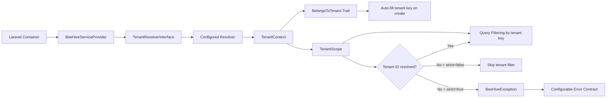

# equidna/bee-hive

Reusable multi-tenant foundation package for Laravel projects.

## What It Includes

- Tenant resolver contract
- Tenant context container
- Eloquent global scope for tenant filtering
- BelongsToTenant trait with automatic tenant key fill
- Service provider with publishable config

## Architecture

Flow summary:

1. The service provider binds the configured tenant resolver and initializes `TenantContext`.
2. `TenantScope` reads the tenant from context to enforce query-level isolation.
3. `BelongsToTenant` uses the same context to auto-assign tenant key values on model creation.
4. In strict mode, missing tenant resolution throws `BeeHiveException` with configurable response contract.

## Error Contract Options

BeeHive exceptions support configurable JSON contracts to keep API error formats consistent across services.

Config keys (in `config/bee-hive.php`):

- `errors.contract`: `enterprise` (default), `flat`, or `problem_details`
- `errors.code`: machine-readable error code (default: `tenant_not_resolved`)
- `errors.include_decorative_payload`: include ASCII bee payload when `true` (default: `false`)

Environment variables:

- `BEE_HIVE_ERROR_CONTRACT`
- `BEE_HIVE_ERROR_CODE`
- `BEE_HIVE_ERROR_DECORATIVE_PAYLOAD`
